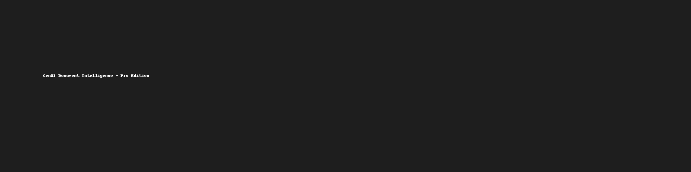

# 📄 GenAI Document Intelligence – Pro Edition
## AI-Powered Document Understanding • Summarization • GPT Insights • Q&A • Full-Stack • SaaS-Ready

<p align="center">
  
</p>

---

# 🚀 Overview

**GenAI Document Intelligence – Pro Edition** is a full-scale, production-ready system that transforms PDFs into structured intelligence using Machine Learning and Generative AI.  
It extracts text, summarizes documents, provides GPT-powered insights, and supports real-time Q&A — all inside a polished full-stack architecture.

This project demonstrates advanced capabilities in:

- 🧠 **Natural Language Processing**
- 🤖 **LLM Integration (GPT)**
- 🗄 **Database Engineering**
- 🎛 **Dashboard & Visualization**
- 🌐 **Frontend + Backend Integration**
- 🐳 **Docker & Kubernetes**
- 🔄 **CI/CD DevOps**
- 📊 **Data Engineering & Automation**

Perfect for **portfolio**, **internships**, **job applications**, and **research projects**.

---

# 🧠 Key Features

### 🔹 1. **PDF Extraction**
Reads multi-page PDFs using `pdfplumber` with clean text extraction.

### 🔹 2. **AI Summarization**
Summarizes long documents using the **DistilBART transformer**.

### 🔹 3. **GPT Intelligence Layer**
Generates:
- Contextual insights  
- Document tone analysis  
- Key highlights  
- Business-level summaries  

### 🔹 4. Q&A Chat System
Ask any question about the uploaded PDF — answered by GPT with document‑aware reasoning.

### 🔹 5. Document Storage (SQLite + SQLAlchemy)
Stores:
- Raw text  
- AI summaries  
- GPT insights  
- Metadata  

### 🔹 6. Next.js Frontend (SaaS-Ready)
Modern UI for:
- Uploading PDFs  
- Viewing summaries  
- Seeing insights  
- Asking questions  

### 🔹 7. Evaluator Dashboard
A backend dashboard to:
- Score document quality  
- Review processed files  
- Inspect logs  

### 🔹 8. DevOps Included
- Dockerfile  
- Kubernetes Deployment + Service  
- GitHub Actions CI/CD  
- Health-check scripts  

---

# 🏗 Architecture Diagram

<p align="center">
  
</p>

---

# 📂 Project Structure

```
GenAI_Document_Intelligence/
│── backend/
│    ├── app.py
│    ├── database.py
│    ├── gpt_explainer.py
│    ├── qa_module.py
│
│── frontend/
│    ├── package.json
│
│── dashboard/
│    ├── evaluator.py
│
│── config/
│    ├── secrets.py
│
│── tests/
│    ├── test_app.py
│    ├── test_db.py
│    ├── test_gpt.py
│    ├── test_qa.py
│
│── k8s/
│    ├── deployment.yml
│    └── service.yml
│
│── .github/workflows/
│    └── ci.yml
│
│── docs/
│    ├── Technical_Report.pdf
│    ├── Recruiter_Summary.md
│    ├── Architecture.png
│    ├── Banner.png
│
│── run.sh
│── docker_healthcheck.sh
│── requirements.txt
│── README.md
```

---

# ⚙️ Installation

### 1️⃣ Install Backend Dependencies
```
pip install -r requirements.txt
```

### 2️⃣ Add OpenAI API Key
Edit:
```
config/secrets.py
```

### 3️⃣ Start Backend
```
streamlit run backend/app.py
```

### 4️⃣ Start Frontend
```
cd frontend
npm install
npm run dev
```

---

# 🐳 Docker Deployment

```
docker build -t genai-doc-intel .
docker run -p 8501:8501 genai-doc-intel
```

---

# ☸ Kubernetes Deployment

```
kubectl apply -f k8s/deployment.yml
kubectl apply -f k8s/service.yml
```

---

# 🧪 Running Tests

```
pytest tests/
```

---

# 📘 Documentation

The `docs/` folder includes:

- 📄 Technical_Report.pdf  
- 🧾 Recruiter_Summary.md  
- 🖼 Architecture Diagram  
- 🎨 Project Banner  

---

# 👨‍💻 Author  
**Aleph Continuum**  
AI Engineer • Full-Stack Developer • GenAI Architect  

---

# ⭐ Like This Project?  
Support it by **starring the repository**.  
It motivates me to build even more powerful AI systems!
